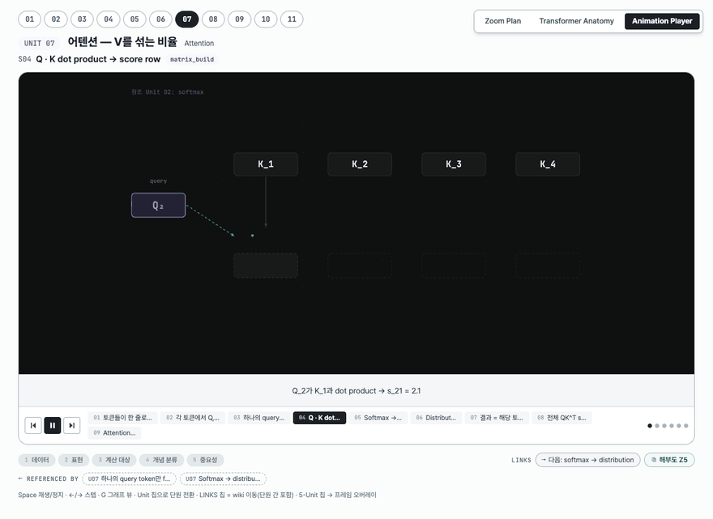
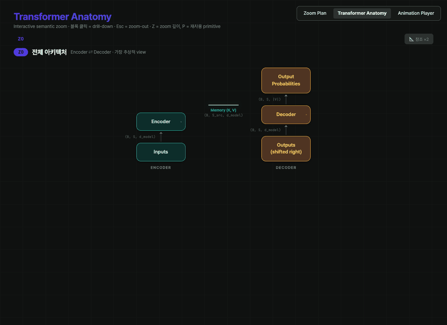

# Visual Explanatory Material on Transformer Architecture

딥러닝/NLP 핵심 개념을 11개 단원 · 102개 씬 애니메이션으로 설명하는 인터랙티브 플레이어입니다. 토큰화·임베딩부터 RNN·LSTM·Seq2Seq·Attention·Multi-Head Attention·Transformer Encoder/Decoder·Loss/Backprop까지 하나의 흐름으로 연결됩니다.

## 🔗 라이브 데모 (GitHub Pages)

설치 없이 바로 실행됩니다:

| 페이지 | 링크 |
|--------|------|
| **Animation Player** — 11단원 씬 애니메이션 | [열기](https://goodand.github.io/Visual-Explanatory-Material-on-Transformer-Architecture/AI-ML%20Animation%20Player.html) |
| **Transformer Anatomy** — 인터랙티브 해부도 (Z0→Z5 zoom) | [열기](https://goodand.github.io/Visual-Explanatory-Material-on-Transformer-Architecture/transformer-anatomy/Transformer%20Anatomy.html) |
| **Zoom Plan** — Z/P 2축 마스터 문서 | [열기](https://goodand.github.io/Visual-Explanatory-Material-on-Transformer-Architecture/Transformer%20Zoom%20Plan.html) |

## 미리보기

**Animation Player** — Unit 07 Attention, Q·K dot product 씬 재생:



**Transformer Anatomy** — Z0 전체 구조에서 블록 클릭으로 Encoder → Layer → MHA 컨테이너까지 semantic zoom:



### 트랜스포머 동작 원리 (참고 애니메이션)

이 프로젝트가 다루는 대상인 트랜스포머의 encoder-decoder 동작 원리를 보여주는 예시 애니메이션입니다 (본 플레이어의 출력물이 아닌 설명용 참고 자료):


## 로컬 실행

정적 파일이라 서버에서 열기만 하면 됩니다 (`file://`로는 JSX 로딩이 막힐 수 있어 로컬 HTTP 서버 권장):

```bash
python3 -m http.server 8000
# 브라우저에서 http://localhost:8000/AI-ML%20Animation%20Player.html
```

React 18 · Babel Standalone · KaTeX · Pretendard/JetBrains Mono 폰트는 CDN에서 로드됩니다.

## 조작

- `Space` 재생/정지 · `←`/`→` 스텝 이동 · `G` 그래프 뷰 토글 (Player)
- 블록 클릭 drill-down · `Esc` zoom-out (Anatomy)
- 상단 Unit 칩으로 단원 전환, LINKS 칩으로 씬 간 위키식 이동
- 하단 5-Unit 프레임 칩 → 개념 프레임 오버레이

## 페이지 (surface)

세 페이지는 우상단 공통 네비게이션(`shared/surface-nav.js`)으로 1클릭 상호 이동합니다. Player의 씬 LINKS 칩은 해부도의 해당 레벨로 딥링크되고(`?level=…&from=…`), 해부도는 원래 씬으로 되돌아갑니다(`#u=NN&s=N`). Zoom Plan의 Z/P 레벨 표는 해부도로 딥링크됩니다.

## 구성

```
AI-ML Animation Player.html          Player 엔트리포인트
Transformer Zoom Plan.html           Z/P 2축 마스터 문서
transformer-anatomy/                 해부도 페이지 (HTML + anatomy-app/data + tweaks-panel)
shared/surface-nav.js                공통 surface 네비게이션 (자기주입 vanilla JS)
_ds/…/                               디자인 시스템 토큰(CSS) + 컴포넌트 번들
animation-viewer/                    tween 엔진 + scene 시각화 (JSX)
storyboard/data-unit01..11.js        11개 단원 씬 데이터
storyboard/refs/                     참조 이미지 (논문 Fig · 강의자료 발췌)
media/                               README 데모 GIF
```

## 커리큘럼

| Unit | 주제 |
|------|------|
| 01 | 토큰화 · 어휘집 · 정수 ID · 임베딩 |
| 02 | 활성화 함수 · Softmax |
| 03 | 선형 · 비선형 · MLP · XOR |
| 04 | RNN |
| 05 | 기울기 소실 · LSTM |
| 06 | Seq2Seq · 인코더-디코더 |
| 07 | Attention |
| 08 | Multi-Head Attention |
| 09 | Transformer Encoder 내부 |
| 10 | Transformer Decoder · 학습 vs 추론 |
| 11 | 손실 · 교차 엔트로피 · 역전파 |

## 참조 이미지 출처

`storyboard/refs/`의 그림은 다음에서 발췌·추출했습니다: Vaswani et al., *Attention Is All You Need* (arXiv:1706.03762) · Jay Alammar, *The Illustrated Transformer* · Clark et al., *What Does BERT Look At?* (arXiv:1906.04341) · 멋쟁이사자처럼 강의자료.
